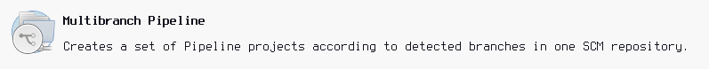
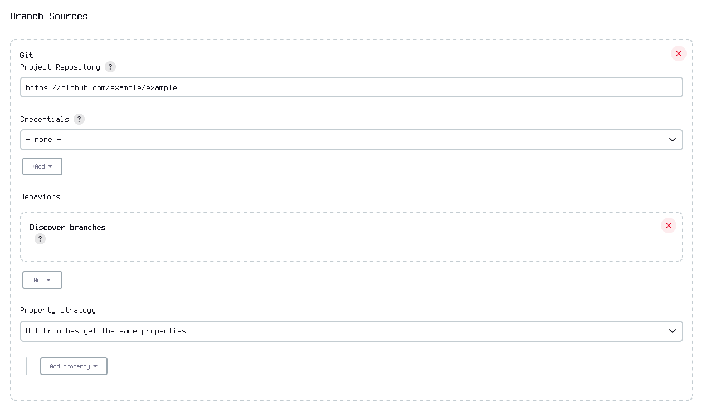
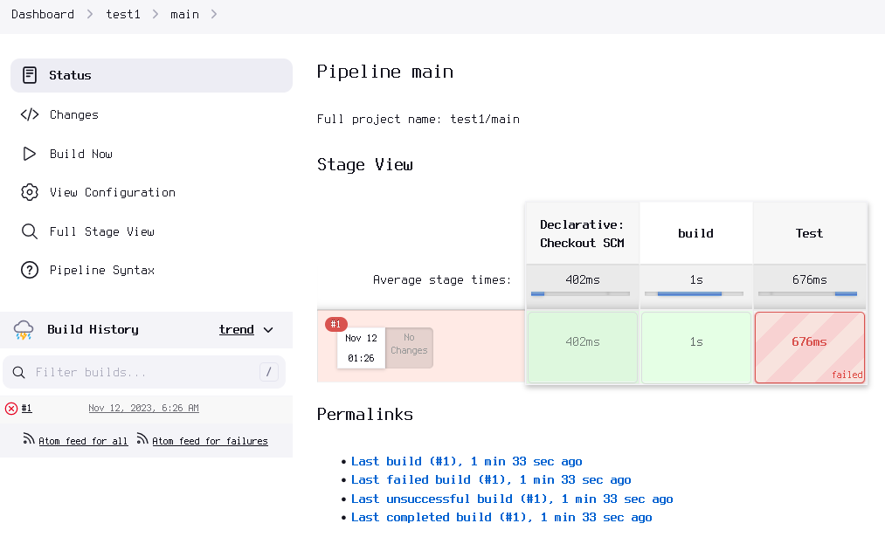
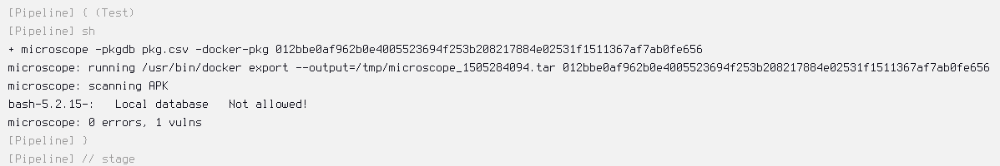

# Setting up a Jenkins pipeline

This tutorial will guide you through setting up a simple Jenkins pipeline to 

## Prerequisites

- Jenkins installed
- Docker installed
- Microscope installed and accessible to Jenkins
- The `jenkins` user must be permitted to run docker commands

## Repository structure

Create a new git repository with the following files:

*pkg.csv*:
```
bash-5.2.15-:, Not allowed!
```
This file blacklists version 5.2.15 of bash.

*Dockerfile*:
```
FROM alpine:3.18
RUN apk add --no-cache bash
ENTRYPOINT ["bash"]
```
The Dockerfile describes a simple Alpine Linux 5.2.15 docker container with bash
installed.

*Jenkinsfile*:
```
pipeline {
    agent any
    stages {
        stage('build') {
            steps {
                script {
                    sh 'docker image build --tag sample:sample - < Dockerfile'
                    def containerName = sh(script: 'docker create sample:sample --name sample', returnStdout: true).trim()
                    println("container name: ${containerName}")
                    env.CONTAINER_NAME = containerName
                }
            }
        }
        stage('Test') {
            steps {
                sh 'microscope -pkgdb pkg.csv -docker-pkg ${CONTAINER_NAME}'
            }
        }
    }
}
```
The Jenkinsfile contains two stages: a build stage, and a test stage. The build
stage creates a docker image from the Dockerfile, and stores its name in a
variable. Then, in the test stage, it runs the Microscope utility to check the
resulting docker container for packages we specified in the package deny list.

Make sure to put the repository somewhere accessible to your Jenkins instance
(such as GitHub).

## Creating the pipeline

Open up the Jenkins dashboard, and create a new item. Enter an item name, select
"Multibranch Pipeline", and click OK.



Add a new git source with the URL of your repository...



...And click "Save".

After Jenkins finishes setting up your pipeline, it should automatically run
for the first time. Go to the pipeline's build history for the main branch. You
should see something like this:



If everything went well, a failed build means that Microscope has detected
something and halted the pipeline. We can check the "Console Output" tab of the
build details to find out what happened. Near the bottom, you should see
something like this:



If Microscope says that there are 0 vulnerabilities and did not stop the build,
the version of bash installed may not be matched up with the version specified
in the package deny list. You can remove the version check to match any version
of bash at all.
